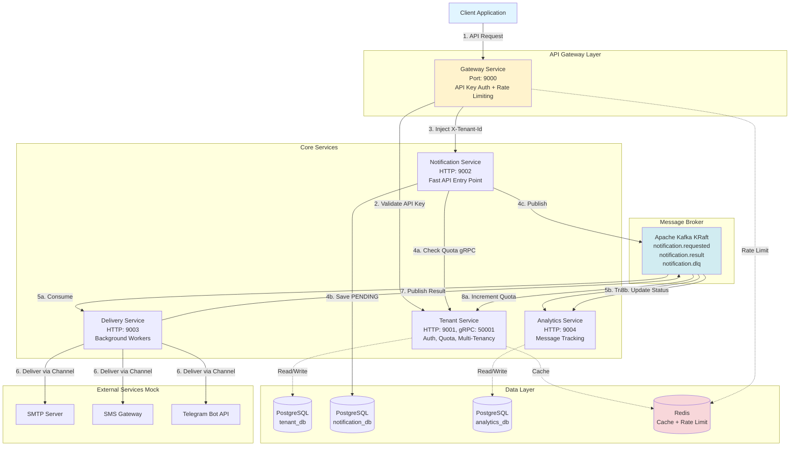
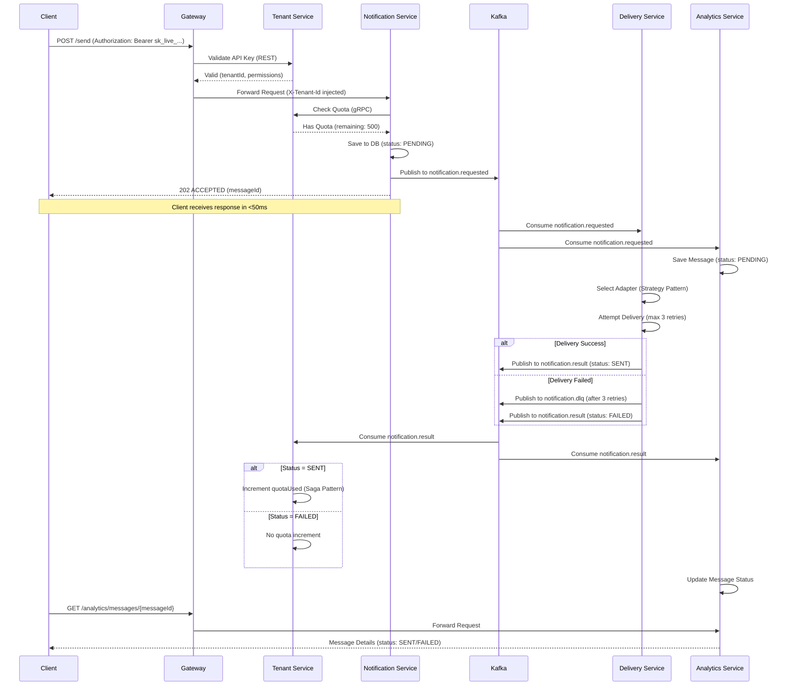
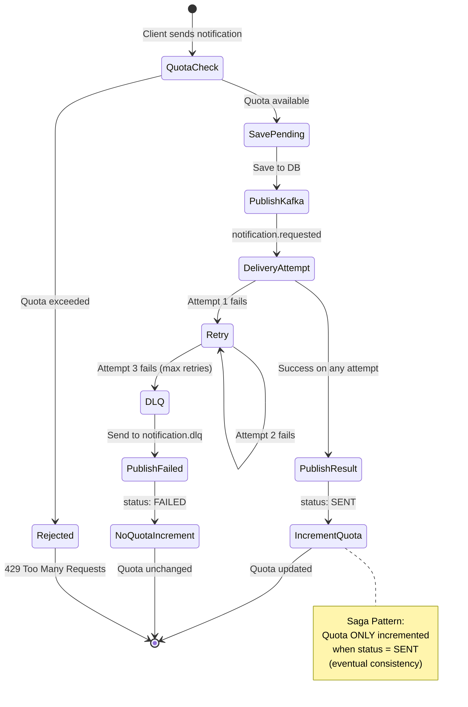
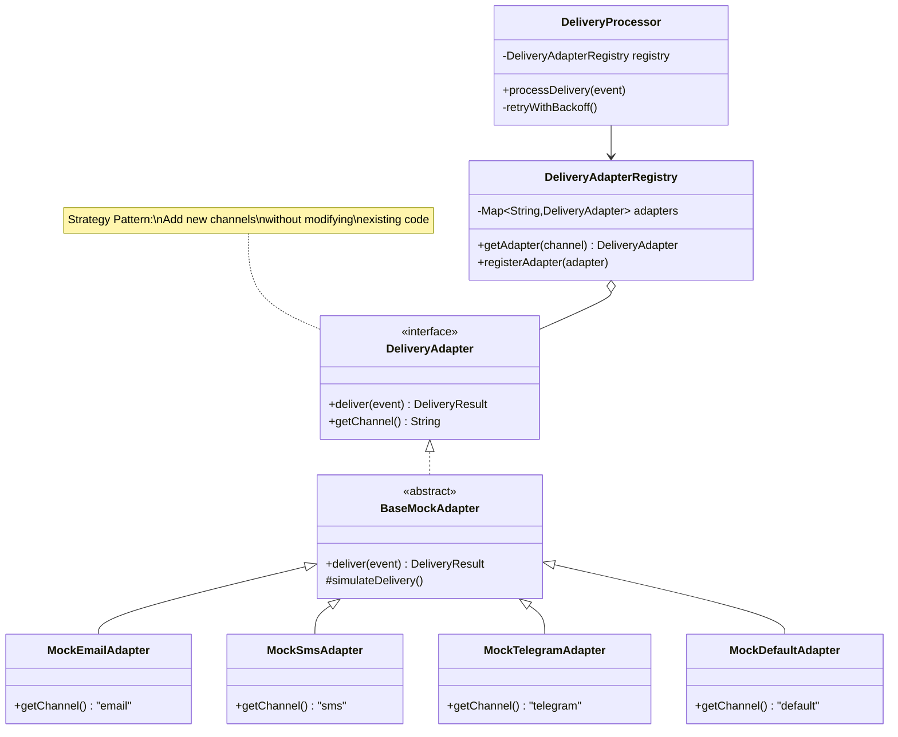
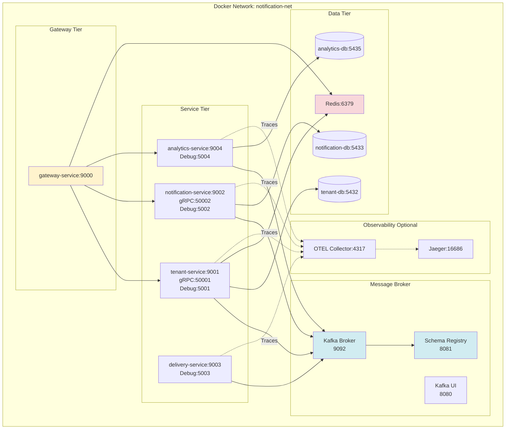
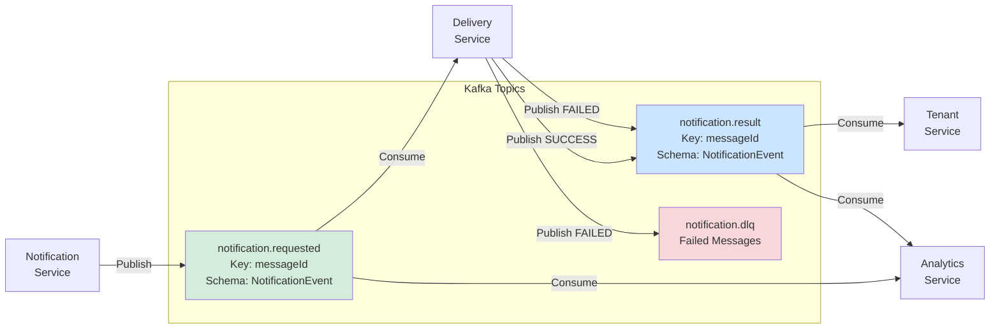
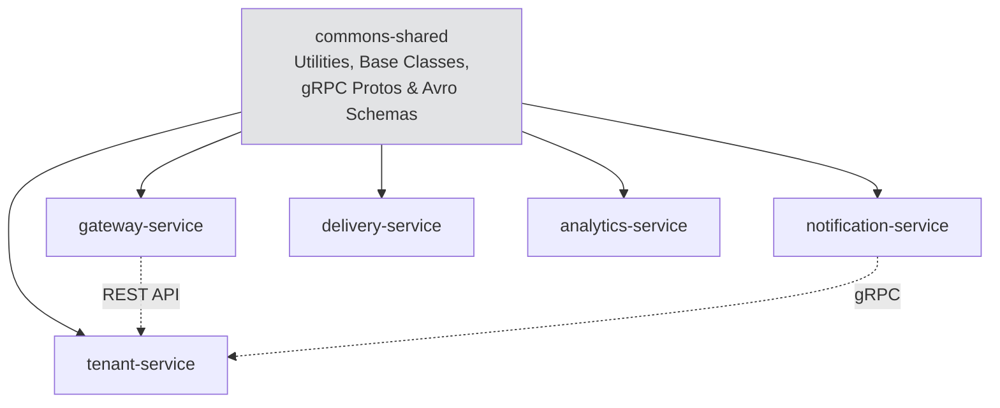
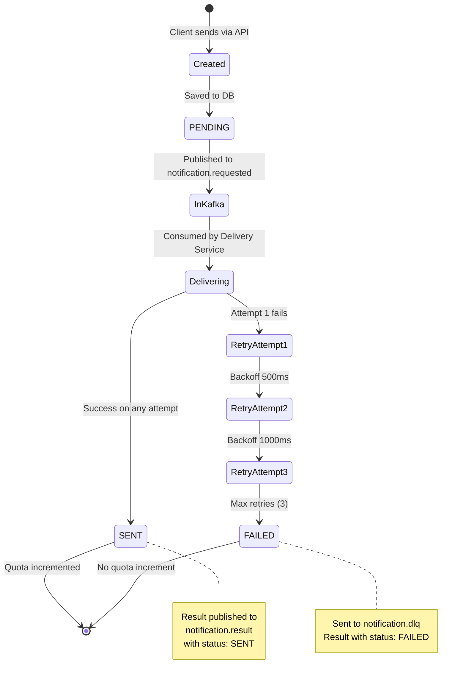
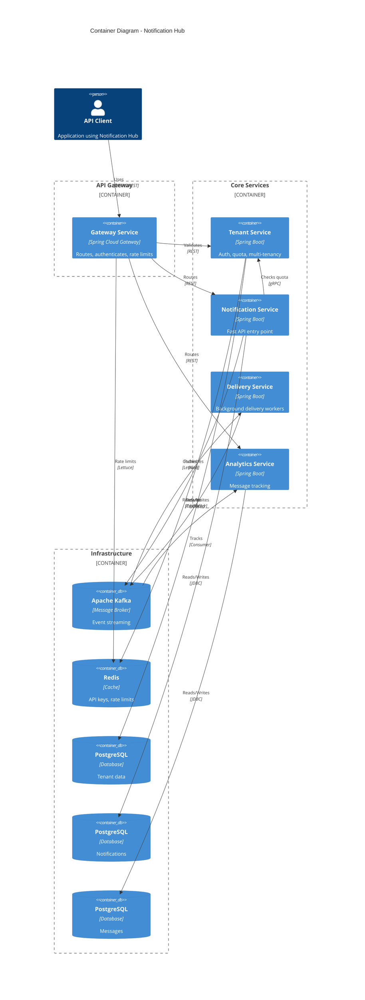

# Notification Hub - Architecture Diagrams

Comprehensive visual documentation of system architecture.

---

## System Architecture Overview



---

## Data Flow Sequence



---

## Quota Saga Pattern



---

## Delivery Service - Strategy Pattern



---

## Deployment Architecture



---

## Kafka Topics Flow



---

## Service Dependencies



---

## Message Lifecycle States



---

## Component Interaction - C4 Container Diagram



---

## How to Use These Diagrams

### 1. View in GitHub
Mermaid diagrams render automatically on GitHub.

### 2. Export as Images

**Using Mermaid CLI:**
```bash
npm install -g @mermaid-js/mermaid-cli

mmdc -i docs/diagrams/ARCHITECTURE_DIAGRAMS.md \
     -o docs/diagrams/system-architecture.png
```

### 3. Edit Diagrams

**Online Editor:** https://mermaid.live
1. Copy diagram code
2. Edit in browser
3. Export as PNG/SVG

### 4. Embed in Documentation

```markdown

```

---

**For more diagrams, see:**
- [Sequence Diagrams](../ARCHITECTURE.md#data-flow)
- [Database Schema](../services/)
